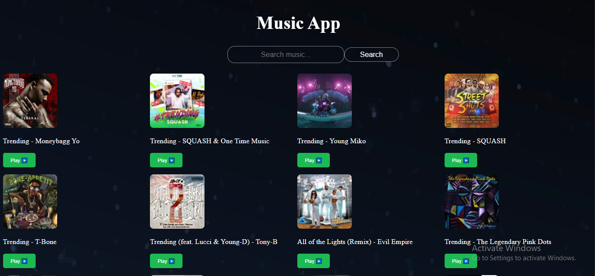

# 🎧 React Music App 🎶

A modern Spotify-style Music App built using **React JS** and the **iTunes API**.  
It lets users search and play song previews with a beautiful dark UI.



## 🚀 Features

- 🔍 Search any song or artist  
- ▶️ Play / ⏸️ Pause music preview  
- 🎨 Spotify-style dark theme UI  
- 🎧 Shows trending songs by default  
- ⚡ Fast, lightweight, responsive design  
- 💻 Built with pure React and CSS  

## 🛠️ Tech Stack

- ⚛️ React JS (with Hooks)  
- 🎧 iTunes Search API  
- 💅 CSS (no frameworks)

## 📦 How to Run the App Locally

```bash
git clone https://github.com/Majidali90121/Music-App.git
cd Music-App
npm install
npm start
```
- ⭐ Show Some Love
- If you liked this project:

- ⭐ Star this repo

- 🍴 Fork it

- 📣 Share it with others

- 🙋‍♂️ Author & API Used
- 👤 Author: Majid Ali

- 🌐 API Used: iTunes Search API

